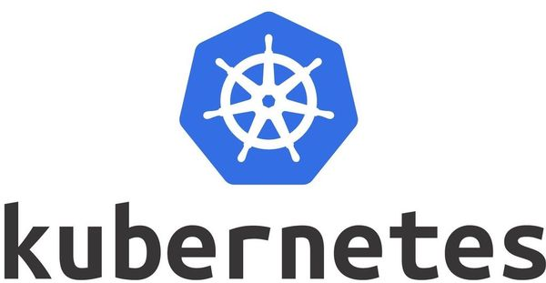
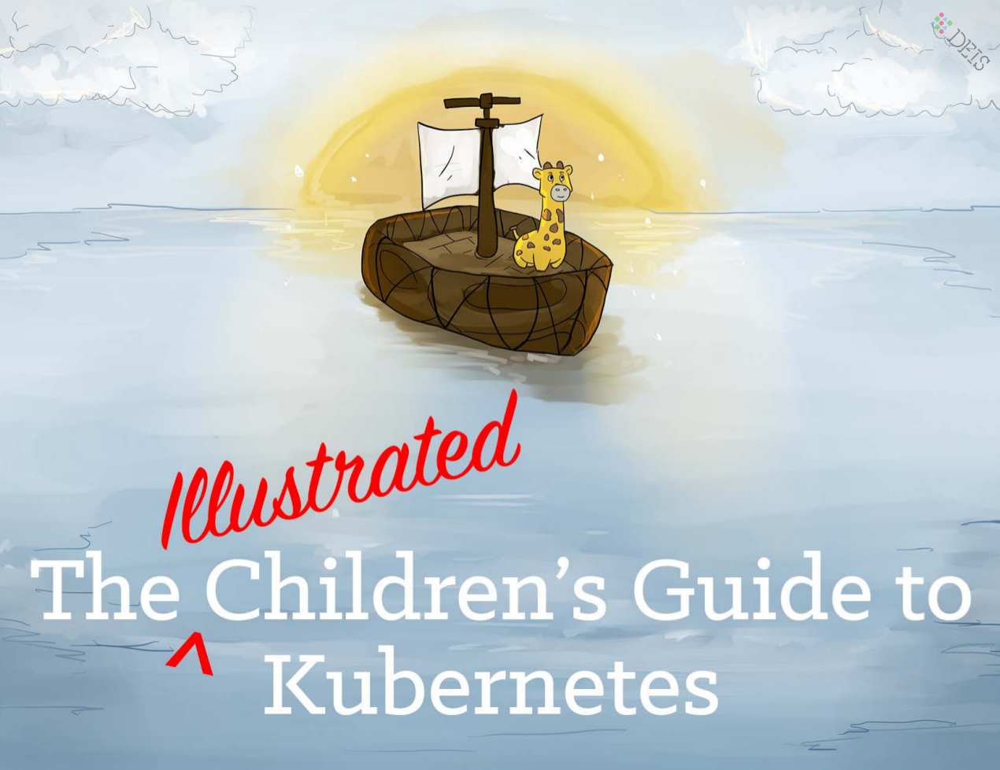

<!-- $theme: gaia -->


Kubernetes

===
#### Sébastien Jardin :fr: - DevOps :metal: ####
#### Oct. 2018 ####

---
# Définition :book: #
>L'orchestration décrit le processus automatique d'organisation, de coordination, et de gestion de systèmes informatiques complexes, de middleware et de services.
>
> <small>-- *[Orchestration Informatique - Wikipedia, the free encyclopedia](https://fr.wikipedia.org/wiki/Orchestration_informatique)*</small>
> 
---
# Historique :books: #

Créer par une petite Startup du nom de Google...


- Dev en mi-2014
- Créer en 2015
---
# Adhésion :heart: #


---
# Nouveautés :newspaper: #

- Open Source
- Orienté infrastructure
- Normé
- Interopérable
- Operators
- API
 
---
# Hosting :computer: #

Choix très nombreux : Cloud, Saas, On-Premise

- GCP - GKE
- AWS - EKS
- Digital Ocean
- OVH
- Ikoula
- Azure
- OpenStack
---
# Infrastrucure #


---
# Déclaratif :hammer: #
Yaml for ever
```
apiVersion: v1
kind: Pod
metadata:
  name: myapp-pod
  labels:
    app: myapp
spec:
  containers:
  - name: myapp-container
    image: busybox
    command: ['sh', '-c', 'echo Hello Kubernetes!']

```
---
# Exploitation :cyclone: #

```
$ kubectl create -f /dir/Mydir/MyProject/nginx-app.yaml
service/my-nginx-svc created
deployment.apps/my-nginx created
```
<br />


---

# Documentation #

Site Officiel : [kubernetes.io](https://kubernetes.io/docs)
Pour débuter : [The illustrated Children's Guide to Kubernetes](https://cdn.chrisshort.net/The-Illustrated-Childrens-Guide-to-Kubernetes.pdf)



---
# Merci :pray: #
## Des questions :question: ##
<br />


<br />

Créer avec [Marp](https://yhatt.github.io/marp/) en Markdown, Libre et gratuit !


<!-- $theme: gaia -->

